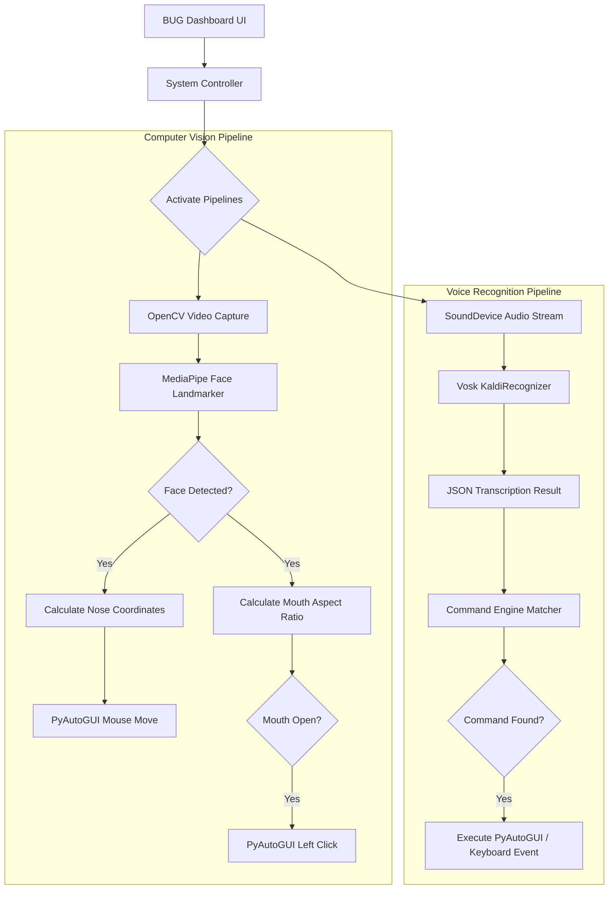
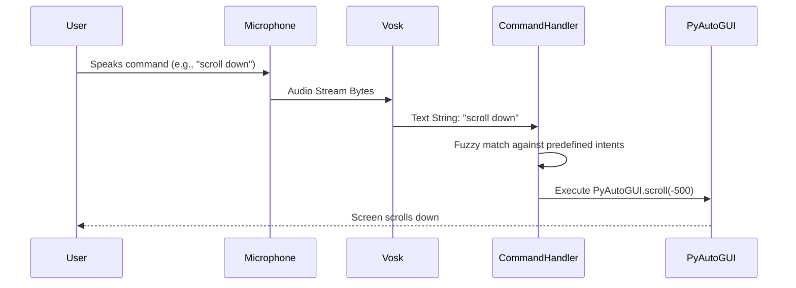

# BUG - Hands-Free Browsing Assistant

_Shared Repository for Final Year project development and documentation._

BUG is an accessible, hands-free browsing assistance system designed to let users control their computer using facial movements and voice commands. It features a modern desktop UI built with PySide6 that seamlessly connects computer vision and speech recognition pipelines.

## 🛠️ Technology Stack

BUG is built using modern and efficient libraries tailored for real-time processing and offline capabilities:

- **Core Language**: Python 3
- **User Interface**: PySide6 (Qt for Python) - For building a sleek, responsive, modern dark-mode dashboard.
- **Computer Vision**:
  - OpenCV (`opencv-python`) - For capturing and processing webcam video streams.
  - MediaPipe - Google's ML framework used for precise Face Landmark detection (nose tracking, mouth state).
- **Speech & Audio**:
  - Vosk (`vosk`) - For fully offline, private, and fast speech recognition.
  - SoundDevice (`sounddevice`) - For capturing low-latency audio streams from the microphone.
- **System Automation**:
  - PyAutoGUI - For simulating mouse movements, clicks, and keyboard strokes.
  - pynput - Additional input listening and manipulation.

## 🚀 Detailed Features

### 1. Face-Tracking Mouse Control

Uses your webcam and Google's MediaPipe Face Landmarker to track your nose bridge and translate it into smooth cursor movements. The mapping dynamically translates physical head movements to screen coordinates, allowing you to navigate seamlessly across the entire display.

### 2. Mouth-Click System

Automatically triggers left-clicks when you open your mouth. It calculates the Mouth Aspect Ratio (MAR) in real-time, instantly firing a click event when the ratio crosses a predefined threshold, effectively replacing a physical mouse button.

### 3. Offline Voice Recognition

Integrated with Vosk KaldiRecognizer for fully offline, private speech recognition. No data is sent to the cloud.

- _Real-time Transcription_: The voice pipeline actively listens and transcribes spoken English into text in real-time.
- _Fuzzy Command Matching_: Transcribed text is matched against an extensive command engine using fuzzy matching, allowing for high accuracy even if words are slightly misheard.

### 4. Modern Dashboard UI

A sleek, dark-mode PySide6 interface designed specifically for accessibility. It provides massive, high-contrast buttons, system status indicators, and a minimalist layout to prevent distraction. Includes controls to independently start/stop vision and voice systems.

## 🗣️ Available Voice Commands

- **Mouse & Scrolling**: `"click"`, `"double click"`, `"right click"`, `"scroll down"`, `"scroll up"`, `"scroll faster"`, `"stop scrolling"`
- **Browser & Tabs**: `"go back"`, `"refresh"`, `"new tab"`, `"close tab"`, `"next tab"`, `"history"`, `"downloads"`
- **Text & Clipboard**: `"copy"`, `"paste"`, `"cut"`, `"undo"`, `"select all"`, `"delete word"`, `"start of line"`, `"end of line"`
- **System & Files**: `"save"`, `"save as"`, `"open file"`, `"new file"`, `"open start menu"`, `"open task manager"`, `"lock computer"`
- **Media Controls**: `"play"`, `"pause"`, `"mute"`, `"volume up"`, `"volume down"`, `"skip forward"`, `"rewind"`
- **Window Management**: `"switch window"`, `"minimize"`, `"close window"`, `"fullscreen"`
- **Dictation**: `"start typing"`, `"stop typing"`
- **Safety**: `"emergency stop"` (stops all automation immediately)

## 📊 System Architecture & Flowcharts

The system consists of two primary asynchronous pipelines running simultaneously alongside the PySide6 main event loop.

### Overall System Flow



### Voice Command Execution Flow



## 💻 OS Compatibility

- **Windows 10/11**: Fully supported out of the box.
- **Linux (Ubuntu, Arch, etc.)**:
  - **X11 Sessions**: Fully supported.
  - **Wayland Sessions**: The camera, UI, and voice will work, but the mouse control (`pyautogui`) will fail due to Wayland's security model. You must use an X11 session or run the experimental Wayland scripts found in the `app/camera/` directory.

## 🛠️ Setup & Installation

1. **Clone the Repository**

   ```bash
   git clone https://github.com/maj-afe/Group-7-s-Projects-Repository.git
   cd Group-7-s-Projects-Repository
   ```

2. **Create a Virtual Environment (Recommended)**

   ```bash
   python -m venv .venv
   # On Windows
   .venv\Scripts\activate
   # On Mac/Linux
   source .venv/bin/activate
   ```

3. **Install Dependencies**
   ```bash
   pip install -r requirements.txt
   ```
   _(Ensure you have downloaded the Vosk model and placed it in the appropriate `models/` directory if required by the codebase, or it will download automatically if implemented)._

## 🏃 Running the Application

To launch the BUG dashboard, simply run the main entry point:

```bash
python app/main.py
```

From the dashboard, you can click **"Start All Systems"** to activate the camera and voice pipelines!
