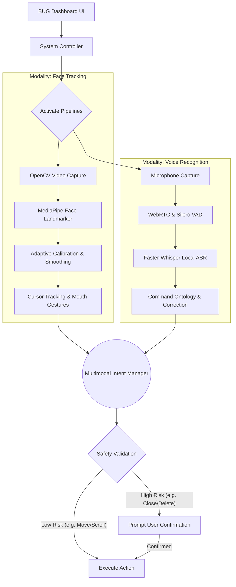
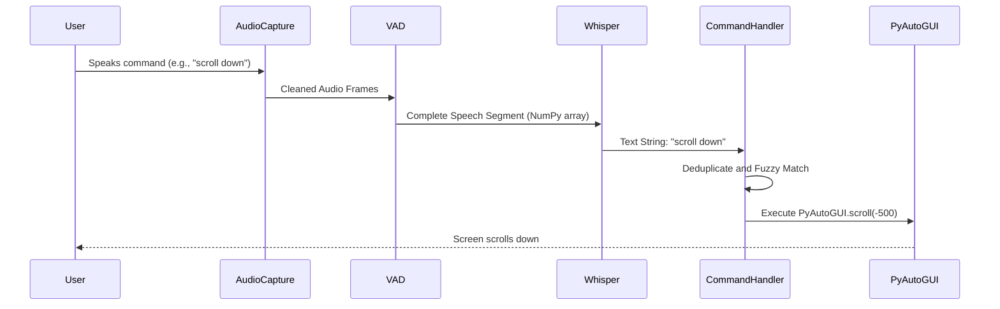

# BUG - Hands-Free Browsing Assistant

_Shared Repository for Final Year project development and documentation._

> [!NOTE]
> 🎓 **Academic Research:** BUG is currently transitioning from an engineering prototype into an adaptive, multimodal research project. **Track our progress and thesis goals in the [RESEARCH_ROADMAP.md](file:///d:/Group-7-s-Projects-Repository/RESEARCH_ROADMAP.md)**.
BUG is an accessible, hands-free browsing assistant designed to let users control their computer using facial movements and voice commands. It features a modern desktop UI built with PySide6 that seamlessly connects computer vision and speech recognition pipelines.

## 🛠️ Technology Stack

BUG is built using modern and efficient libraries tailored for real-time processing and offline capabilities:

- **Core Language**: Python 3
- **User Interface**: PySide6 (Qt for Python) - For building a sleek, responsive, modern dark-mode dashboard.
- **Computer Vision**:
  - OpenCV (`opencv-python`) - For capturing and processing webcam video streams.
  - MediaPipe - Google's ML framework used for precise Face Landmark detection (nose tracking, mouth state).
- **Speech & Audio**:
  - SoundDevice (`sounddevice`) - For capturing low-latency audio streams from the microphone.
  - WebRTC Audio Processing (`pywebrtc-audio`) - For noise suppression, acoustic echo cancellation, and automatic gain control.
  - Silero VAD (`silero-vad`) - A fast, neural-network-based Voice Activity Detector to perfectly segment speech.
  - Faster-Whisper (`faster-whisper`) - For fully offline, highly accurate, and fast speech transcription.
  - RapidFuzz (`rapidfuzz`) - For lightning-fast fuzzy matching of transcripts to system commands.
- **System Automation**:
  - PyAutoGUI - For simulating mouse movements, clicks, and keyboard strokes.
  - pynput - Additional input listening and manipulation.

## 🚀 Detailed Features

### 1. Face-Tracking Mouse Control

Uses your webcam and Google's MediaPipe Face Landmarker to track your nose bridge and translate it into smooth cursor movements. The mapping dynamically translates physical head movements to screen coordinates, allowing you to navigate seamlessly across the entire display.

### 2. Mouth-Click System

Automatically triggers left-clicks when you open your mouth. It calculates the Mouth Aspect Ratio (MAR) in real-time, instantly firing a click event when the ratio crosses a predefined threshold, effectively replacing a physical mouse button.

### 3. Offline Voice Recognition

Integrated with a state-of-the-art voice pipeline designed for noisy environments, working entirely offline for absolute privacy.

- _Acoustic Cleaning_: The microphone feed passes through WebRTC APM to cancel echo and suppress background noise.
- _Voice Activity Detection_: Silero VAD isolates exact speech segments, preventing the transcriber from processing silence or background noise.
- _Real-time Transcription_: Faster-Whisper (using the `base` int8 model) transcribes speech segments quickly and accurately.
- _Fuzzy Command Matching_: The transcript goes through deduplication logic and RapidFuzz to match spoken intents even if the transcript is slightly imperfect.

### 4. Modern Dashboard UI

A sleek, dark-mode PySide6 interface designed specifically for accessibility. It provides massive, high-contrast buttons, system status indicators, and a minimalist layout to prevent distraction. Includes controls to independently start/stop vision and voice systems.

## 🗣️ Available Voice Commands

- **Mouse & Scrolling**: `"click"`, `"double click"`, `"right click"`, `"scroll down"`, `"scroll up"`, `"scroll faster"`, `"scroll slower"`, `"stop scrolling"`, `"up"`, `"down"`
- **Browser & Tabs**: `"go back"`, `"go forward"`, `"refresh"`, `"new tab"`, `"close tab"`, `"next tab"`, `"previous tab"`, `"history"`, `"downloads"`, `"bookmarks"`
- **Zoom**: `"zoom in"`, `"zoom out"`, `"reset zoom"`
- **Websites & Search**: `"open chrome"`, `"open youtube"`, `"open reddit"`, `"open facebook"`, `"open instagram"`, `"open github"`, `"open chat gpt"`, `"open netflix"`, `"open amazon"`, `"search [query]"`
- **Text & Clipboard**: `"copy"`, `"paste"`, `"cut"`, `"undo"`, `"redo"`, `"select all"`, `"delete word"`, `"select next word"`, `"select previous word"`, `"start of line"`, `"end of line"`
- **Keyboard Keys**: `"press enter"`, `"press tab"`, `"press escape"`, `"backspace"`, `"yes"`, `"no"`, `"cancel"`
- **System & Files**: `"save"`, `"save as"`, `"new file"`, `"open file"`, `"open notepad"`, `"open calculator"`, `"open start menu"`, `"open task manager"`, `"lock computer"`, `"help"`
- **Media Controls**: `"play"`, `"pause"`, `"mute"`, `"unmute"`, `"volume up"`, `"volume down"`, `"skip forward"`, `"skip back"`, `"next video"`
- **Window Management**: `"switch window"`, `"minimize window"`, `"close window"`, `"fullscreen"`
- **Dictation**: `"start typing"`, `"stop typing"` (transcribes speech directly as keyboard input)
- **Tracking & Calibration**: `"enable/disable head tracking"`, `"enable/disable mouth click"`, `"calibrate"`, `"calibrate mouth"`, `"reset calibration"`
- **Safety**: `"emergency stop"` (stops all automation immediately), `"enable control"` (resumes after an emergency stop)

## 📊 System Architecture & Flowcharts

BUG implements an **Adaptive, Offline, Multimodal Control Architecture**. Rather than running face tracking and voice recognition as isolated input mechanisms, BUG arbitrates between modalities using a Multimodal Intent Manager, applying dynamic calibration and safety validations before executing actions.

### Overall System Flow



### Voice Command Execution Flow



## 💻 OS Compatibility

- **Windows 10/11**: Fully supported out of the box.
- **Linux (Ubuntu, Arch, etc.)**:
  - **X11 Sessions**: Fully supported.
  - **Wayland Sessions**: The camera, UI, and voice will work, but the mouse control (`pyautogui`) will fail due to Wayland's security model. You must use an X11 session or run the experimental Wayland scripts found in the `app/camera/` directory.

## 🛠️ Setup & Installation

1. **Clone the Repository**

   ```bash
   git clone https://github.com/maj-afe/Group-7-s-Projects-Repository.git
   cd Group-7-s-Projects-Repository
   ```

2. **Create a Virtual Environment (Recommended)**

   ```bash
   python -m venv .venv
   # On Windows (Powershell)
   .\.venv\Scripts\activate
   # On Mac/Linux
   source .venv/bin/activate
   ```

3. **Install Dependencies**
   ```bash
   pip install -r requirements.txt
   ```
   *(Faster-Whisper and Silero VAD will automatically download their required model files to `models/` upon the first launch.)*

## 🏃 Running the Application

To launch the BUG dashboard, simply run the main entry point:

```bash
.\run.ps1
```

*(Alternatively, run `python app/main.py` if not using the helper script)*

From the dashboard, you can click **"Start All Systems"** to activate the camera and voice pipelines!

## 📦 Building a Standalone Executable

If you want to package the application into a single `.exe` file that can be shared and run on any Windows machine without needing Python installed, you can use the included build script:

1. Ensure you have installed the requirements (`pip install -r requirements.txt`).
2. Run the build script in PowerShell:
   ```bash
   .\build.ps1
   ```
3. The standalone executable will be generated at `dist\BUG_Dashboard.exe`.
   *(Note: The executable is large (~400MB) because it bundles PyTorch and OpenCV. On its first run, it will automatically download the required AI models to your local user folder.)*


## Dynamic Application Launcher 

We've added a powerful new feature that makes BUG even more useful for hands-free computing:

Open Any App with Your Voice: No more reaching for the mouse or keyboard to launch applications

Works on Any Windows PC: Dynamically discovers installed apps - no hardcoded paths or configuration needed

Smart & Safe: Only launches apps when you use open, launch, or start commands, preventing accidental launches

Seamless Integration: Works alongside existing website commands - "open google" opens the website, while "open chrome" launches the Chrome application

This feature transforms BUG from a browsing assistant into a complete hands-free computer control system!


 ## Voice-Controlled Window Management 

BUG now includes powerful Voice-Controlled Window Management that lets you control application windows using voice commands. Powered by Windows Win32 APIs via pywin32, this feature enables complete hands-free window management.

Available Commands:

Switch to an application window:

"switch to chrome" → Brings Chrome window to foreground

"switch to visual studio code" → Brings VS Code to foreground

"switch to notepad" → Brings Notepad to foreground

"switch to spotify" → Brings Spotify to foreground

"switch to discord" → Brings Discord to foreground

Minimize specific windows:

"minimize chrome" → Minimizes Chrome window

"minimize visual studio code" → Minimizes VS Code

"minimize notepad" → Minimizes Notepad

Maximize specific windows:

"maximize chrome" → Maximizes Chrome window

"maximize visual studio code" → Maximizes VS Code

"maximize notepad" → Maximizes Notepad

Move active window:

"move window left" → Moves active window 100px left

"move window right" → Moves active window 100px right

"move window up" → Moves active window 100px up

"move window down" → Moves active window 100px down

Close active window:

"close this window" → Closes the currently active window


##  GUI Power Control
BUG now includes a Graphical Confirmation System for power commands, replacing unreliable voice-based confirmation with a safe, visual dialog box.

Why GUI Confirmation?

Whisper sometimes misrecognizes "yes"/"no" from normal speech

Random transcripts like "set down computer", "turn down computer" could trigger unwanted actions

GUI confirmation is safer, more reliable, and user-friendly

Available Commands:

Command	Action	Confirmation
"lock computer"	Locks Windows	✅ GUI Popup
"sleep computer"	Puts PC to sleep	✅ GUI Popup
"restart computer"	Restarts PC	✅ GUI Popup
"shutdown computer"	Shuts down PC	✅ GUI Popup
Confirmation Flow:

text
User: "restart computer"
                    ↓
┌──────────────────────────────────────────────┐
│             Confirm Restart                   │
├──────────────────────────────────────────────┤
│                                              │
│  Are you sure you want to restart the        │
│  computer?                                   │
│                                              │
│        [ YES ]          [ NO ]              │
│                                              │
└──────────────────────────────────────────────┘
                    ↓
        ┌───────────┴───────────┐
        │                       │
        ▼                       ▼
   Click YES               Click NO
        │                       │
        ▼                       ▼
   Action Executes         Cancelled
   (Restart/Shutdown)      (Do Nothing)
Technical Implementation:

Uses Qt Signals for thread-safe GUI communication

Voice processing runs in background thread, GUI on main thread

QMessageBox for professional, consistent dialog

Modal dialog prevents accidental actions

Clear error handling and logging

Safety Features:

✅ No voice confirmation (eliminates Whisper misrecognition)

✅ Graphical YES/NO buttons only

✅ Modal dialog (must click to continue)

✅ Dialog appears on top of all windows

✅ Emergency stop still works

