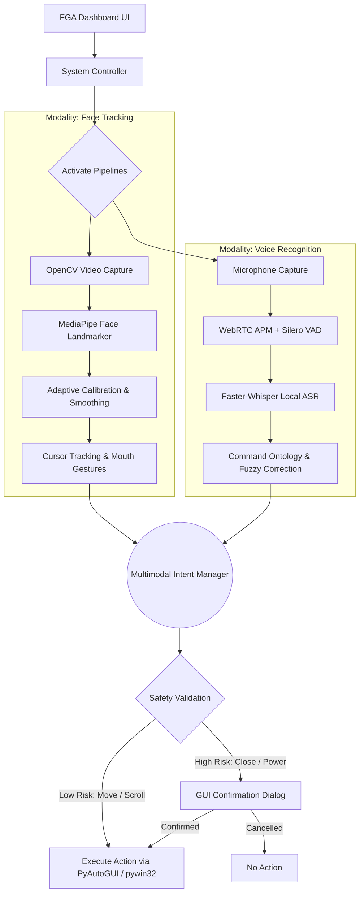
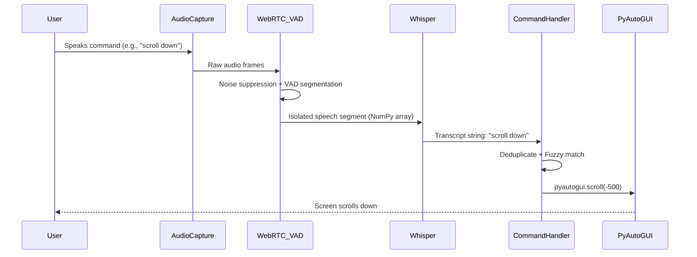

# Face Gesture Assistant

> _Shared Repository for Final Year Project development and documentation._
> 🎓 **Academic Research:** Face Gesture Assistant is transitioning from an engineering prototype into an adaptive, multimodal research project. Track our progress in [RESEARCH_ROADMAP.md](./RESEARCH_ROADMAP.md).

**Face Gesture Assistant** is an accessible, fully **offline**, hands-free desktop control system that allows users to operate their computer entirely through **facial movements** and **voice commands**. It is built for individuals with motor disabilities or anyone who needs a completely touchless computing experience.

---

## 📑 Table of Contents

1. [Project Overview](#-project-overview)
2. [Key Features](#-key-features)
3. [Technology Stack](#️-technology-stack)
4. [System Architecture](#-system-architecture)
5. [Module Breakdown](#-module-breakdown)
6. [Voice Commands Reference](#️-voice-commands-reference)
7. [GUI Features](#️-gui-features)
8. [OS Compatibility](#-os-compatibility)
9. [Setup & Installation](#️-setup--installation)
10. [Running the Application](#-running-the-application)
11. [Building a Standalone Executable](#-building-a-standalone-executable)
12. [Testing](#-testing)
13. [Project Structure](#-project-structure)
14. [Research Roadmap](#-research-roadmap)
15. [Contributing](#-contributing)

---

## 🎯 Project Overview

Face Gesture Assistant (FGA) investigates an **adaptive, offline, multimodal control architecture** that:

- Personalizes interaction parameters to each user's motor behavior
- Arbitrates intelligently between facial gesture and voice inputs
- Measures accuracy, latency, false activations, and resource consumption
- Runs entirely on local hardware — **no cloud, no internet required**

The system is being developed as a **Final Year Engineering Project / Research Thesis** by Group 7.

---

## ✨ Key Features

| Feature | Description |
|---|---|
| 🎥 **Face-Tracking Mouse** | Moves the cursor in real-time by tracking your nose bridge via webcam |
| 👄 **Mouth-Click System** | Opens mouth to left-click — replaces a physical mouse button |
| 🗣️ **Offline Voice Control** | Full voice command pipeline with noise cancellation, VAD, and local Whisper ASR |
| 🪟 **Window Management** | Switch, minimize, maximize, move, or close windows entirely by voice |
| 📱 **Dynamic App Launcher** | Launch any installed Windows application by voice — no hardcoded paths |
| 🔒 **GUI Power Controls** | Lock, sleep, restart, or shutdown the PC with safe graphical confirmation dialogs |
| 📝 **Voice Dictation Mode** | Transcribe speech directly as keyboard input into any application |
| 🆘 **Emergency Stop** | Instantly halt all automation with a single voice command |
| 🎛️ **Modern Dashboard** | Sleek dark-mode PySide6 UI with status indicators and quick controls |
| 🔧 **Adaptive Calibration** | Personalize head-tracking sensitivity and mouth-click threshold per user |

---

## 🛠️ Technology Stack

FGA is built using modern, efficient libraries tailored for real-time processing and offline-first operation:

### Core Language
- **Python 3.10+**

### User Interface
| Library | Purpose |
|---|---|
| **PySide6** | Qt-based cross-platform GUI — dark-mode dashboard, dialogs, overlays |

### Computer Vision
| Library | Purpose |
|---|---|
| **OpenCV** (`opencv-python`, `opencv-contrib-python`) | Webcam capture and video frame processing |
| **MediaPipe** | Google's ML framework — Face Landmark detection (468 landmarks) for nose tracking and mouth state |

### Speech & Audio
| Library | Purpose |
|---|---|
| **SoundDevice** | Low-latency microphone audio capture |
| **pywebrtc-audio** | WebRTC APM — noise suppression, echo cancellation, automatic gain control |
| **Silero VAD** | Neural network Voice Activity Detector — isolates speech segments precisely |
| **Faster-Whisper** | Fully offline ASR using quantized INT8 Whisper models — fast, accurate transcription |
| **RapidFuzz** | Fuzzy string matching — maps imperfect transcripts to known commands |

### System Automation
| Library | Purpose |
|---|---|
| **PyAutoGUI** | Mouse movement, clicks, keyboard strokes simulation |
| **pynput** | Additional input listening and low-level input control |
| **pywin32** | Windows Win32 APIs — window management (focus, minimize, maximize, move) |
| **psutil** | System process information for app detection |

### Dev & Testing
| Library | Purpose |
|---|---|
| **pytest** | Test suite runner |
| **python-dotenv** | Environment variable management |

---

## 📊 System Architecture

Face Gesture Assistant implements an **Adaptive, Offline, Multimodal Control Architecture**. Rather than running face tracking and voice recognition as completely independent silos, FGA uses a **Multimodal Intent Manager** to arbitrate between modalities, apply dynamic calibration, and run safety validations before executing any action.

### Overall System Flow



### Voice Command Execution Flow



### Face Tracking Flow


---

## 🗂️ Module Breakdown

The `app/` directory is organized into focused, single-responsibility modules:

```
app/
├── main.py                          # Entry point — launches the Qt application
├── camera/                          # Face tracking & computer vision
│   ├── camera.py                        # Webcam capture manager
│   ├── face_tracker.py                  # High-level face tracking coordinator
│   ├── face_cursor_windows_varient.py   # Windows-optimized cursor mapping
│   ├── face_cursor_wayland.py           # Wayland (Linux) cursor mapping
│   ├── facecursor.py                    # Core cursor translation logic
│   ├── EXP.py / EXPs.py                # Experimental calibration scripts
│   └── face_landmarker.task            # Bundled MediaPipe model file (~3.6 MB)
├── voice/                           # Full speech recognition pipeline
│   ├── audio_capture.py                 # Microphone stream management (SoundDevice)
│   ├── audio_processor.py               # WebRTC APM preprocessing
│   ├── vad.py                           # Silero VAD — speech segmentation
│   ├── whisper_engine.py                # Faster-Whisper transcription engine
│   ├── speech_recognition.py            # Orchestrates audio to VAD to Whisper
│   ├── command_handler.py               # Maps transcripts to actions (RapidFuzz)
│   └── voice_assist.py                  # High-level voice assistant controller
├── gestures/                        # Gesture detection layer
│   ├── gesture_detector.py              # Unified gesture event dispatcher
│   ├── head_tracking.py                 # Head movement to cursor position
│   └── mouth_detection.py               # Mouth Aspect Ratio to click events
├── control/                         # System automation layer
│   ├── mouse_control.py                 # Mouse movement and click actions
│   ├── keyboard_control.py              # Keyboard simulation and text input
│   └── window_control.py               # Window focus, minimize, maximize (pywin32)
├── core/                            # Application core & settings
│   ├── command_engine.py                # Central command dispatcher
│   └── settings.py                      # Global config and user preferences
├── ui/                              # PySide6 user interface
│   ├── main_window.py                   # Primary dashboard window
│   ├── dashboard.py                     # Dashboard widget layout
│   ├── voice_overlay.py                 # Live voice transcript HUD overlay
│   ├── calibration_ui.py                # Calibration wizard UI
│   ├── learn_dialog.py                  # Command learning / help dialog
│   └── wizard_dialog.py                 # First-run setup wizard
├── system/                          # System-level integrations
└── utils/                           # Shared utilities and helpers
```

---

## 🗣️ Voice Commands Reference

Face Gesture Assistant supports a comprehensive set of voice commands covering every aspect of desktop control:

### 🖱️ Mouse & Scrolling

| Command | Action |
|---|---|
| `"click"` | Left mouse click |
| `"double click"` | Double left click |
| `"right click"` | Right mouse click |
| `"scroll down"` / `"down"` | Scroll page down |
| `"scroll up"` / `"up"` | Scroll page up |
| `"scroll faster"` / `"scroll slower"` | Adjust scroll speed |
| `"stop scrolling"` | Halt auto-scroll |

### 🌐 Browser & Tabs

| Command | Action |
|---|---|
| `"go back"` / `"go forward"` | Browser navigation |
| `"refresh"` | Reload current page |
| `"new tab"` / `"close tab"` | Tab management |
| `"next tab"` / `"previous tab"` | Tab switching |
| `"history"` / `"downloads"` / `"bookmarks"` | Open browser panels |

### 🔍 Zoom

| Command | Action |
|---|---|
| `"zoom in"` / `"zoom out"` | Browser zoom |
| `"reset zoom"` | Reset to 100% |

### 🌍 Websites & Search

| Command | Action |
|---|---|
| `"open youtube"`, `"open reddit"`, `"open github"`, etc. | Open website in browser |
| `"open chrome"`, `"open notepad"`, `"open calculator"` | Launch application |
| `"search [query]"` | Google search for the query |

> **Dynamic App Launcher:** Beyond hardcoded apps, Face Gesture Assistant dynamically discovers any installed Windows application. Say `"open [app name]"` for any installed program — no configuration needed. Safely gated behind `open`, `launch`, or `start` keywords to prevent accidental launches.

### 📋 Text & Clipboard

| Command | Action |
|---|---|
| `"copy"` / `"paste"` / `"cut"` | Clipboard operations |
| `"undo"` / `"redo"` | Edit history |
| `"select all"` | Select all text |
| `"delete word"` | Delete previous word |
| `"select next word"` / `"select previous word"` | Word selection |
| `"start of line"` / `"end of line"` | Line navigation |

### ⌨️ Keyboard Keys

| Command | Action |
|---|---|
| `"press enter"` / `"press tab"` / `"press escape"` | Key presses |
| `"backspace"` | Delete character |
| `"yes"` / `"no"` / `"cancel"` | Confirmation responses |

### 🪟 Window Management

| Command | Action |
|---|---|
| `"switch to [app]"` | Bring app window to foreground |
| `"minimize [app]"` / `"maximize [app]"` | Resize specific window |
| `"move window left/right/up/down"` | Move active window 100px |
| `"close this window"` | Close the active window |
| `"switch window"` | Alt+Tab |
| `"fullscreen"` | Toggle fullscreen |

### ⚡ System & Power

| Command | Action | Confirmation |
|---|---|---|
| `"lock computer"` | Lock Windows session | GUI popup |
| `"sleep computer"` | Put PC to sleep | GUI popup |
| `"restart computer"` | Restart the PC | GUI popup |
| `"shutdown computer"` | Shut down the PC | GUI popup |
| `"open start menu"` | Open Windows Start Menu | — |
| `"open task manager"` | Open Task Manager | — |
| `"save"` / `"save as"` / `"new file"` / `"open file"` | File operations | — |

### 🎵 Media Controls

| Command | Action |
|---|---|
| `"play"` / `"pause"` | Media play/pause |
| `"mute"` / `"unmute"` | Audio mute toggle |
| `"volume up"` / `"volume down"` | Volume adjustment |
| `"skip forward"` / `"skip back"` | Media seek |
| `"next video"` | Next media item |

### 📝 Dictation Mode

| Command | Action |
|---|---|
| `"start typing"` | Enter dictation mode — speech is typed directly as keyboard input |
| `"stop typing"` | Exit dictation mode |

### 🎛️ Tracking & Calibration

| Command | Action |
|---|---|
| `"enable head tracking"` / `"disable head tracking"` | Toggle face cursor |
| `"enable mouth click"` / `"disable mouth click"` | Toggle mouth-click |
| `"calibrate"` | Run full calibration wizard |
| `"calibrate mouth"` | Recalibrate mouth-click threshold |
| `"reset calibration"` | Restore default calibration |

### 🆘 Safety

| Command | Action |
|---|---|
| `"emergency stop"` | **Immediately disables all automation** |
| `"enable control"` | Resumes automation after emergency stop |
| `"help"` | Open the command reference dialog |

---

## 🖥️ GUI Features

### Main Dashboard
The PySide6 dark-mode dashboard provides:
- **Large, high-contrast control buttons** — Start All Systems, Stop All, individual pipeline toggles
- **Live status indicators** — Camera, Voice, and Tracking state chips
- **Real-time voice transcript overlay** — see what FGA heard in a floating HUD
- **Settings and calibration access** from the toolbar

### Voice Overlay
A transparent floating window that appears when voice is active, showing the last recognized command in real-time for immediate feedback.

### Calibration Wizard
Step-by-step guided setup for:
- **Head tracking calibration** — sets the neutral center point and sensitivity range
- **Mouth-click calibration** — measures resting mouth distance and sets the open/click threshold

### GUI Power Confirmation Dialogs

For high-risk power commands, Face Gesture Assistant uses a **safe graphical dialog** instead of voice confirmation (which is unreliable due to Whisper misrecognition):

```
User: "restart computer"
           |
+----------------------------------------------+
|              Confirm Restart                   |
+----------------------------------------------+
|                                               |
|  Are you sure you want to restart the         |
|  computer?                                    |
|                                               |
|        [ YES ]          [ NO ]               |
|                                               |
+----------------------------------------------+
           |
   +-------+-------+
   |               |
Click YES       Click NO
   |               |
Action Executes  Cancelled
```

**Technical implementation:**
- Uses Qt Signals for thread-safe communication between voice thread and GUI main thread
- `QMessageBox` for a professional, consistent modal dialog
- Modal dialog blocks all other input until resolved
- Emergency stop remains active even while dialog is open

**Safety features:**
- No voice confirmation — eliminates Whisper misrecognition risk
- Graphical YES/NO buttons only
- Modal dialog — must click to continue
- Dialog appears on top of all windows
- Emergency stop still functional

---

## 💻 OS Compatibility

| OS | Status | Notes |
|---|---|---|
| **Windows 10 / 11** | Fully supported | All features work out of the box |
| **Linux — X11 Session** | Fully supported | Use Wayland scripts in `app/camera/` |
| **Linux — Wayland Session** | Partial | Camera, UI, and voice work; `pyautogui` mouse control fails due to Wayland security model |
| **macOS** | Not tested | `pywin32` (Windows-only) is unavailable |

> **Wayland users:** Run the experimental Wayland-compatible cursor scripts located in `app/camera/`.

---

## 🛠️ Setup & Installation

### Prerequisites
- **Python 3.10 or higher**
- A **webcam** (for face tracking)
- A **microphone** (for voice commands)
- **Windows 10/11** recommended (or Linux with X11)

### 1. Clone the Repository

```bash
git clone https://github.com/maj-afe/Group-7-s-Projects-Repository.git
cd Group-7-s-Projects-Repository
```

### 2. Create a Virtual Environment (Recommended)

```bash
python -m venv .venv
```

**Activate the environment:**

```powershell
# Windows (PowerShell)
.\.venv\Scripts\activate
```

```bash
# macOS / Linux
source .venv/bin/activate
```

### 3. Install Dependencies

```bash
pip install -r requirements.txt
```

> **Note:** On first launch, **Faster-Whisper** and **Silero VAD** will automatically download their required model files into the `models/` directory. An internet connection is only needed for this initial download.

### 4. MediaPipe Model (Bundled)

The MediaPipe Face Landmarker model (`face_landmarker.task`, ~3.6 MB) is already bundled in `app/camera/` — no separate download required.

---

## 🏃 Running the Application

### Using the Helper Script (Recommended)

```powershell
.\run.ps1
```

### Direct Python Launch

```bash
python app/main.py
```

Once the dashboard opens:
1. Click **"Start All Systems"** to activate both the camera and voice pipelines simultaneously.
2. Or use the individual **"Start Camera"** / **"Start Voice"** buttons to enable pipelines independently.
3. Use **"Calibrate"** on first run to set your personal head-tracking and mouth-click sensitivity.

---

## 📦 Building a Standalone Executable

Face Gesture Assistant can be packaged into a single `.exe` using PyInstaller — no Python installation required on the target machine.

### Steps

1. Ensure dependencies are installed:
   ```bash
   pip install -r requirements.txt
   ```

2. Run the build script:
   ```powershell
   .\build.ps1
   ```

3. The executable is generated at:
   ```
   dist\BUG_Dashboard.exe
   ```

> **Note:** The executable is large (~400 MB) because it bundles PyTorch, OpenCV, and MediaPipe. On first run, it will download required AI models to your local user folder.

The build configuration is defined in [`BUG_Dashboard.spec`](./BUG_Dashboard.spec).

---

## 🧪 Testing

Face Gesture Assistant includes a dedicated test suite in the `tests/` directory:

| Test File | Coverage |
|---|---|
| `test_commands.py` | Voice command mapping and fuzzy matching logic |
| `test_audio.py` | Audio capture and pipeline integrity |
| `test_vad.py` | Voice Activity Detection accuracy |
| `test_accuracy.py` | End-to-end command recognition accuracy metrics |

### Running Tests

```bash
# Run the full test suite
pytest tests/

# Run a specific test file with verbose output
pytest tests/test_commands.py -v

# Run with short traceback
pytest tests/ --tb=short
```

### Smoke Tests

Quick sanity checks available at the root level:

```bash
python _smoke.py            # General system smoke test
python _transcribe_test.py  # Whisper transcription smoke test
```

---

## 📁 Project Structure

```
Group-7-s-Projects-Repository/
|
├── app/                          # Main application source
│   ├── main.py                   # Entry point
│   ├── camera/                   # Face tracking & computer vision
│   ├── voice/                    # Speech recognition pipeline
│   ├── gestures/                 # Gesture event detection
│   ├── control/                  # System automation (mouse, keyboard, windows)
│   ├── core/                     # Command engine & settings
│   ├── ui/                       # PySide6 GUI components
│   ├── system/                   # System-level integrations
│   └── utils/                    # Shared utilities
|
├── models/                       # Downloaded AI model files (auto-populated on first run)
├── tests/                        # Pytest test suite
├── whisper.cpp/                  # Git submodule — whisper.cpp for benchmarking
├── _whisper_stubs/               # Type stubs for Whisper
|
├── requirements.txt              # Python dependencies
├── run.ps1                       # Quick-launch PowerShell script
├── build.ps1                     # PyInstaller build script
├── BUG_Dashboard.spec            # PyInstaller spec file
├── _smoke.py                     # System smoke test
├── _transcribe_test.py           # Whisper transcription test
├── RESEARCH_ROADMAP.md           # Thesis goals and research progress
└── README.md                     # This file
```

---

## 🔬 Research Roadmap

Face Gesture Assistant is actively evolving as a research project. The five core research contributions are:

| # | Contribution | Status |
|---|---|---|
| 1 | **Adaptive Personal Calibration** — Dynamic sensitivity based on user motor range | In Progress |
| 2 | **Cross-modal Intent Arbitration** — Multimodal Intent Manager merging face + voice | In Progress |
| 3 | **False-Action & Safety Suppression** — Risk classification + GUI confirmation policies | Partial (Emergency Stop done) |
| 4 | **Offline Resource Efficiency** — Benchmarking Whisper.cpp vs Faster-Whisper vs Vosk | Partial (Faster-Whisper deployed) |
| 5 | **User Evaluation** — Formal trials measuring target acquisition time, throughput, workload | To Do |

For full details, task breakdowns, and the thesis statement, see **[RESEARCH_ROADMAP.md](./RESEARCH_ROADMAP.md)**.

---

## 🤝 Contributing

This is a Final Year Project repository maintained by **Group 7**. To contribute:

1. Create a new branch for your feature or fix:
   ```bash
   git checkout -b feature/your-feature-name
   ```
2. Commit your changes with a clear message:
   ```bash
   git commit -m "feat: describe what you did"
   ```
3. Push and open a Pull Request against `main`.
4. Ensure all tests pass before requesting review:
   ```bash
   pytest tests/
   ```

---

<div align="center">

**Face Gesture Assistant** — Built with love by Group 7 | Final Year Project

_Making computing accessible, one gesture at a time._

</div>
